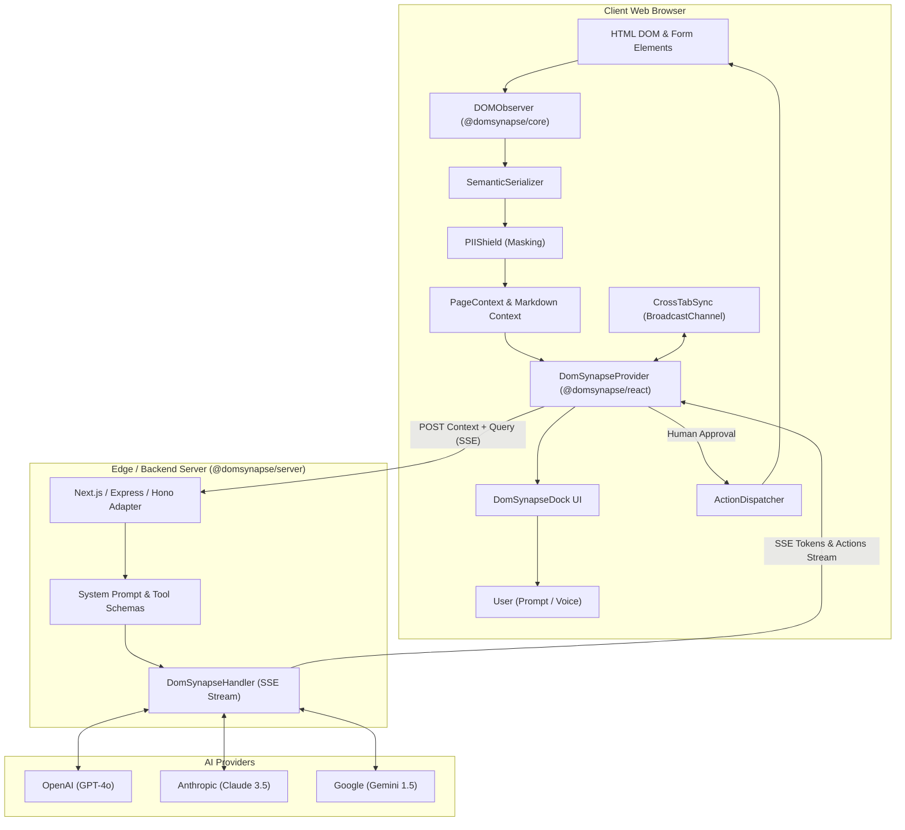
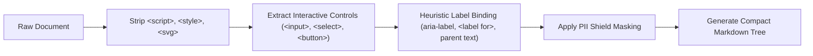
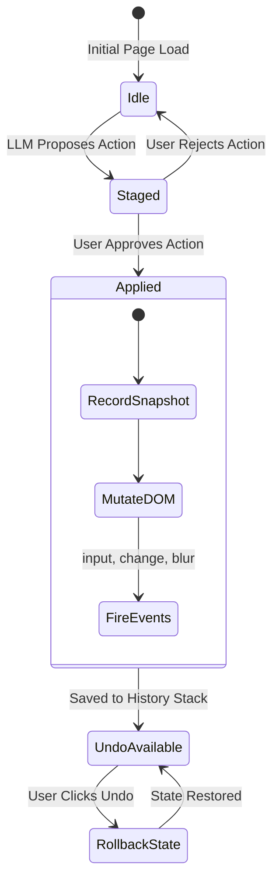
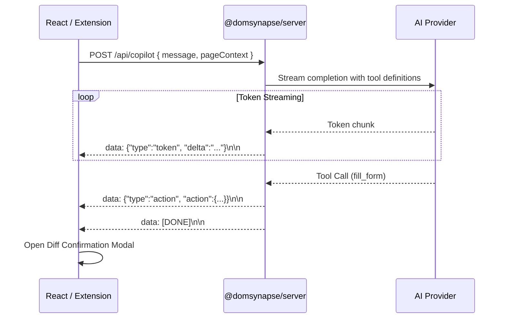

# DomSynapse Architecture 🏛️

This document details the architectural design, data pipelines, and state machines underlying the DomSynapse copilot ecosystem.

---

## 1. System High-Level Topology



---

## 2. Token Pruning & Semantic Serialization

Raw HTML documents typically contain hundreds of kilobytes of boilerplate: SVG paths, layout divs, style tags, script elements, inline attributes, and deeply nested wrappers. Passing raw HTML directly to an LLM produces:
1. Massive token consumption (high API latency and cost).
2. Context window saturation.
3. Hallucination on irrelevant visual nodes.

### Pruning Pipeline



### Compression Benchmark
- Typical Onboarding Page Raw HTML: **~4,200 tokens**
- DomSynapse Semantic Markdown: **~350 tokens**
- **Token Efficiency Gain**: **~91.6% reduction**

---

## 3. PII Masking Shield

The PII Shield sanitizes sensitive end-user inputs before page state is transmitted across the wire.

### Built-in Masking Rules
- **Credit Cards**: Matches Visa, MasterCard, Amex, Discover Luhn-compliant digits (`****-****-****-1234`).
- **Social Security Numbers (SSN)**: Matches `***-**-6789`.
- **Passwords**: Matches `type="password"` inputs (`[REDACTED_PASSWORD]`).
- **Email & Phone**: Regex-based masking with preservation of domain structure (`a***@example.com`).

### Developer Overrides
Developers can annotate elements directly in HTML:
- `data-synapse-mask`: Unconditionally forces PII masking on the element.
- `data-synapse-ignore`: Completely removes the element and all child nodes from LLM awareness.

---

## 4. Multi-Level Undo / Redo State Machine

The `ActionDispatcher` and `FormStateManager` maintain an immutable history snapshot tree:



### Event Simulation for Reactive Frameworks
Modern frontend frameworks like React, Vue, Svelte, and Angular bind form controls to internal state trackers (e.g., React's SyntheticEvent system and `_valueTracker`). Simply setting `element.value = 'x'` does not notify the framework.

DomSynapse bypasses this limitation by:
1. Accessing native prototype property setters:
   ```ts
   const valueSetter = Object.getOwnPropertyDescriptor(
     window.HTMLInputElement.prototype, 'value'
   )?.set;
   valueSetter?.call(element, newValue);
   ```
2. Dispatching sequential synthetic events:
   ```ts
   element.dispatchEvent(new Event('input', { bubbles: true }));
   element.dispatchEvent(new Event('change', { bubbles: true }));
   element.dispatchEvent(new Event('blur', { bubbles: true }));
   ```

---

## 5. Server-Sent Events (SSE) Streaming Protocol

To minimize perceived latency, DomSynapse streams tokens incrementally from the LLM to the client while simultaneously parsing tool call events:



---

## 6. Cross-Tab Synchronization

DomSynapse coordinates across multiple browser tabs using `BroadcastChannel`:
- **Channel**: `domsynapse_sync_channel`
- **Events**:
  - `action_executed`: Notifies other tabs that a form action was completed.
  - `history_changed`: Synchronizes `canUndo` / `canRedo` state across tabs.
  - `spotlight_triggered` / `spotlight_dismissed`: Coordinates visual cues when navigating between views.
- **Fail-Safe**: Gracefully degrades in environments where `BroadcastChannel` is unsupported or restricted by sandbox permissions.
